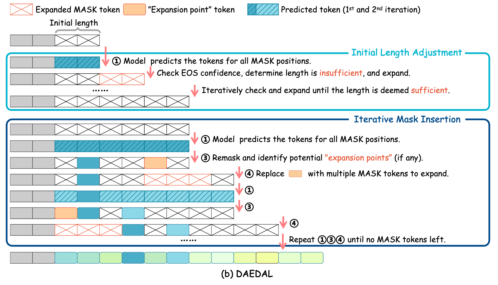

<!-- _class: lead -->
# <!-- fit -->dLM Unchained
#### Reclaiming Parallelism, Revision, and Memory from MDLM.

Pingzhi (Stanley) Tang
stanleytang@stu.pku.edu.cn

$$
\DeclareMathOperator{\cat}{Cat}
\DeclareMathOperator{\geo}{Geo}
\newcommand{\Z}{\mathbb{Z}}
\newcommand{\N}{\mathbb{N}}
\newcommand{\R}{\mathbb{R}}
\newcommand{\C}{\mathbb{C}}
\newcommand{\E}{\mathbb{E}}
\newcommand{\x}{\boldsymbol{x}}
\newcommand{\z}{\boldsymbol{z}}
\newcommand{\p}{\boldsymbol{p}}
\newcommand{\e}{\boldsymbol{e}}
\newcommand{\Q}{\boldsymbol{Q}}
\newcommand{\K}{\boldsymbol{K}}
\newcommand{\V}{\boldsymbol{V}}
\newcommand{\I}{\boldsymbol{I}}
\newcommand{\u}{\boldsymbol{u}}
\newcommand{\L}{\mathcal{L}}
\newcommand{\KL}{D_{\mathrm{KL}}}
\newcommand{\1}{\boldsymbol{1}}
\newcommand{\boldpi}{\boldsymbol{\pi}}
$$

# Table of Contents

- Why dLM?
    - i.e., what's wrong with autoregressive LLMs and what are the potential benefits of dLLMs?
- dLM (MDLM) recap
- State-of-the-art dLLMs: open / closed-source
- Drawbacks of the current dLLMs(MDLMs)
- dLM unchained
    - Reclaiming Parallelism, Revision, and Memory from MDLM.

<!-- 
1. 明确一下为什么大家最近对 dLLM 这么感兴趣，dllm有什么可能的好处
2. 在mys的基础上复习一下language diffusion的setting
3. 然后我们来看一下一些比较现代的（今年以来的）dllm
4. 然后我们看看这些模型有什么问题
5. 最后就是我这次talk的最核心的内容，就是有哪些可能的方法来改进
-->

<!-- footer: '' -->

# <!-- _class: lead -->Why dLM?

## Why dLM?
Autoregressive Modeling: Downsides
- Tokens generated from left to right, one by one.
    - Limited parallelism leads to low utilization of GPUs.
    - Prevents useful, novel generation styles like **infilling**.
    - Tends to degenerate and accumulate errors as the sequence length increases. (Sampling "drifts" by Yann LeCun)
    - Not a reasonable bias for some tasks (e.g. [Sudoku](#dream-4)).
    - Reversal curse. 

<!-- 
从左往右的生成方式可能对于general的语言来说是一个比较合理的inductive bias
但是其实是相当硬件不友好的
同时也不适合填空，不过这一点其实我现在有点怀疑这是否是一个问题，因为大模型其实可以前后文都给他，他也可以实现很好的填空；反而是diffusion这种方式，要填多少个词/多少个token其实是很难确定的，因为词和token并不是1:1的
对于general的语言或者spoken language来说，从左往右是合理的，但是会不会有一些其他的任务可能是不合适的, 比如大家在对比dlm和llm的时候经常会对比的一个指标就是数独，他的测试方法就是把一个n*n的数字序列输进去，ar-llm就只能顺序的生成
最后一个是reversal curse，就是现在大模型的一个现象，就是很难给下句说上句，或者他知道a is b，但是你问他b is a，他就不知道了
-->

## Why dLM?

What we expect from a dLM?

- Faster generation speed: multi-tokens generated at a time
- More robust to errors with iterative refinement.
- More flexible generation styles like infilling.
- Full context awareness with bi-directional attention.
- Control the generation quality with #steps of denoising (may be a better way for test-time compute?).
- When high quality data becomes the bottleneck, dLM may provide better results. See [github](https://jinjieni.github.io/dlms-are-super-data-learners/resources/pdf/Diffusion_Language_Models_are_Super_Data_Learners.pdf).

# <!-- _class: lead -->Discrete Diffusion Recap

## D3PM
<!-- footer: Austin et al., [alphaxiv](https://www.alphaxiv.org/abs/2107.03006) -->

D3PM derives principles for discrete diffusion with arbitrary transition kernels $[\Q_t]_{ij} = q(x_t=i|x_{t-1}=j)$:
- Forward process
    $$
    \begin{aligned}
    q(x_t | x_{t-1}) &= \cat(x_t; \p=\Q_t\x_{t-1}) \\
    q(x_t | x_0) &= \cat(x_t; \p=\bar{\Q}_t\x_0)
    \end{aligned}
    $$
- Reverse process
    $$
    q(x_{t-1} | x_t, x_0) = \frac{q(x_t | x_{t-1}) q(x_{t-1} | x_0)}{q(x_t | x_0)}
    = \cat(x_{t-1}; \p=\frac{\Q_t^\top \x_t \odot \bar{\Q}_{t-1}\x_0}{\x_t^\top \bar{\Q}_t\x_0})
    $$

<!-- 
这里回顾一下d3pm
d3pm对于任意的转移矩阵推导出来discrete diffusion的loss
这里粗体的x表示one-hot编码，非粗体的x表示原始的离散变量
cat是分类分布，这个分布可以分解为多个one-hot编码的加权和，每个类别的权重可以用p中的对应元素表示
所以x的概率就是x^\top p

离散和连续的区别就在，这个转移的kernel是一个矩阵，表示了从t-1步到t步任意两种状态之间的转移概率；为了计算的方便，往往这个矩阵是非常稀疏的，比如mask diffusion就是每一列只有两个地方的值不是0
-->

## D3PM

- Loss
    $$
    \begin{align}
        \L_{\mathrm{vb}} = \E_{q(x_0)}\bigg[&
        \underbrace{\KL[q(x_T | x_0) \vert\vert p(x_T)]}_{\L_T}
        + \sum_{t=2}^T \underbrace{\E_{q(x_t|x_0)} \big[
            \KL[q(x_{t-1} | x_t, x_0) \vert\vert 
            p_{\theta}(x_{t-1}|x_t)]
            \big]}_{\L_{t-1}} \\
        &\underbrace{- \E_{q(x_1|x_0)} [\log p_{\theta}(x_0|x_1)]}_{\L_0}
        \bigg].
    \end{align}
    $$
- Parameterization of the reverse process
    $$
    {
    \small
    \begin{align}
        p_{\theta}(x_{t-1}|x_t) &= \E_{x_0 \sim \widetilde{p}_{\theta}(\cdot|x_t)} [q(x_{t-1} | x_t, x_0) ] \\
        \L_{\mathrm{aux}} &= \E_{q(x_0)} \E_{q(x_t|x_0)} [-\log \widetilde{p}_{\theta}(x_0|x_t)]
    \end{align}
    }
    $$

<!-- 
这里的loss就是标准的diffusion的loss，额外再加上一项

上面的loss是标准的kl，其中的每一项我们刚刚都已经得到了；
根据q的具体形式，我们可以把kl的式子化简一下；
对于逆向过程的建模，他们的选择是建模x_t -> x_0
-->

## MDLM (MD4)

<!-- footer: Shi et al., [alphaxiv](https://www.alphaxiv.org/abs/2406.04329); Sahoo et al., [alphaxiv](https://www.alphaxiv.org/abs/2406.07524) -->

For continuous time absorbing state diffusion, MD4 finds that the ELBO can be further simplied.
- Absorbing state:
    $$
    \begin{gather}
    \Q_i = (1 - \beta_i)\I + \beta_i \e_m \1^\top \\
    \bar{\Q}_i = \prod_{j=1}^i \Q_j = \alpha_i \I + (1 - \alpha_i) \e_m \1^\top, \text{where } \alpha_i = \prod_{j=1}^i(1 - \beta_j)
    \end{gather}
    $$
- Continuous time limit: $t(i) = i / T, \beta(t(i)) = T\beta_i, T\to \infty$
    $$
    \bar{\Q}(t) = \lim_{T\to\infty} \bar{Q}_i = \alpha_t \I + (1 - \alpha_t) \e_m \1^\top, \text{where } \alpha_t = \exp\left(-\int_0^t\beta(s) \mathrm{d} s\right)
    $$

## MDLM (MD4)

$$
\begin{align}
    \L_{\mathrm{vb}} = \E_{q(x_0)}\bigg[&
    \underbrace{\KL[q(x_T | x_0) \vert\vert p(x_T)]}_{\L_T}
    + \sum_{t=2}^T \underbrace{\E_{q(x_t|x_0)} \big[
        \KL[q(x_{t-1} | x_t, x_0) \vert\vert 
        p_{\theta}(x_{t-1}|x_t)]
        \big]}_{\L_{t-1}} \\
    &\underbrace{- \E_{q(x_1|x_0)} [\log p_{\theta}(x_0|x_1)]}_{\L_0}
    \bigg].
\end{align}
$$

In continuous time absorbing state diffusion:
- $\L_T$ is constant and can be ignored.
- $\L_0 \to 0$.
- $\lim_{T \to \infty} \sum_{t=2}^T \L_{t-1} = \int_0^1 \frac{\alpha_t'}{1 - \alpha_t} \E_{q(x_t|x_0)} [\delta_{x_t, m} \log \widetilde{p}_{\theta}(x_0|x_t)] \mathrm{d} t$ is the weighted cross entropy loss on masked tokens.

<!-- 
这里不严格的说明一下

在MD4和MDLM中，两个同期的工作发现
在D3PM中效果最好的absorbing state dlm里，如果把时间建模成连续的
那么diffusion很复杂的那个loss就化简成了一个weighted cross entropy loss
这里也是mys讲过的

这里的\frac{\alpha_t'}{1 - \alpha_t}在\alpha_t = 1 - t的时候就是-1/t
有时候这一项会直接拿出来被写作w(t), 其实就是用来平衡不同难度的去噪的loss的贡献
如果t比较大，也就是noise比较大，这个去噪的难度就会比较大，所以我们就需要给更小的weight
-->

## MDLM (MD4)

For multi-dimensional data (e.g. a sequence) $\x_t = (x_t^{(1)}, \ldots, x_t^{(N)})$, we select the forward process that can be factorized as:
$$
q(\x_t | \x_s) = \prod_{i=1}^N q(x_t^{(i)} | x_s^{(i)})
$$
- As a result, the forward marginals $q(\x_t|\x_0)$ and reversal $q(\x_{t-1} | \x_t, \x_0)$ also factorize.
- Model defination: $p_{\theta}(\x_s|\x_t) \triangleq \prod_{i=1}^N 
\E_{\x_0 \sim \widetilde{p}_{\theta}(\cdot|\x_t)}
[q(x_s^{(i)} | x_t^{(i)}, x_0^{(i)})]$

<!-- 
之前讲的全是单一维度的建模，我们这里讨论一下向量，也就是sequence的情况
实际上我们前向建模的时候就是把他们假设为独立，分解开来加噪
反向的时候也是同理，但是在model x_0的时候，我们还是需要考虑词和词之间的相关性，所以模型建模输出x_0的时候是输入整个序列，输出所有的预测的词

所以这里的模型就天然的能用一个bert来实现：
输入的是n个token，输出的是n个probability distribution
-->

## Why MDLM?

1. Absorbing state dLMs perform the best, exceeding other counterparts like uniform diffusion.

  

<!-- 
前两次mys讲了这么多可能的dlm的建模方式，但是为什么我这里只写mdlm

后面我们可以发现，现在几乎所有的开源模型都用了这个setting
主要原因我们之前也看到了，absorbing state的效果好
-->

## Why MDLM?

2. Therotically more elegant (simple) and easier to implement.
    >   However, existing work in this area has been hindered by unnecessarily complex model formulations and unclear relationships between different perspectives, leading to suboptimal parameterization, training objectives, and ad hoc adjustments to counteract these issues

## Why MDLM?

3. Mean parameterization in MDLM has be proven to be equivalent to score-based parameterization in SEDD / RADD but the former enforces an additional constraint, leading to more stable training.
    - SEDD models concrete score function: $s(x_t, t)_j \triangleq \frac{q_t(j)}{q_t(x_t)}$.
    - In MD4 paper, they show that:
        $$
        s(m, t)_j = \frac{\alpha_t}{1 - \alpha_t} \E[x_0 | x_t = m]^\top e_j, \text{which satisfies} \sum_{j\neq m} s(m, t)_j = \frac{\alpha_t}{1 - \alpha_t}
        $$
    - This implies that a reasonable score model for a mask state is:
        $$
        s(m, t)_j = \frac{\alpha_t}{1 - \alpha_t} \widetilde{p}_{\theta}(j | x_t=m)
        $$

<!-- 
这里补充了一下md4中的一个小结论，具体的证明可以看md4的附录
他这里证明了score-based model的concrete score function和mdlm是等价的
但是用mdlm的话，保证了概率分布，多一个先验的约束，所以更好学

虽然说mdlm有种种好处，但是其实他也有很多问题，之后可以看到
-->

# <!-- _class: lead -->State-of-the-art dLLMs
<!-- footer: '' -->

## State-of-the-art dLLMs

Open-source:
- LLaDA series from RUC: [LLaDA](https://www.alphaxiv.org/abs/2502.09992), [LLaDA-1.5](https://www.alphaxiv.org/pdf/2505.19223), [LLaDA-V](https://www.alphaxiv.org/pdf/2505.16933), [LLaDA-MoE](https://huggingface.co/inclusionAI/LLaDA-MoE-7B-A1B-Instruct)(7B-A1B)
- Dream series from HKU: [Dream 7B](https://www.alphaxiv.org/html/2508.15487), [Dream-Coder](https://github.com/DreamLM/Dream-Coder), [DreamOn](https://github.com/DreamLM/DreamOn)
- [SDAR](https://github.com/JetAstra/SDAR) series from Shanghai AI Lab: 1.7B, 4B, 8B, 30B-A3B MoE, technical report to be released.

Closed-source:
- [Mercury Coder](https://chat.inceptionlabs.ai/): closed-source with a brief technical [report](https://www.alphaxiv.org/pdf/2506.17298).
- [Gemini Diffusion](https://deepmind.google/models/gemini-diffusion/): no technical details.
- [Seed Diffusion](https://www.alphaxiv.org/abs/2508.02193): closed-source with a brief technical report, < 15B.

<!-- 
这里是所有主流的开源和闭源模型
所有的开源模型都是用了mdlm
闭源模型只有seed有一个简短的技术报告，这个报告里说明了他用了mdlm的范式
其他两个就不得而知了，但是一会我给大家看一些演示可能可以有一点推测
这几个闭源的模型主推的都是快，基本上每个都能达到1000-2000token/s的非常夸张的速度

这里的所有模型都是今年推出的
最早的llada是今年二月份，然后mercury coder过了两天就发布了，不过他的技术报告在6月才发布
然后是四月的dream，五月的gemini diffusion, gemini的这个没有任何技术细节，连内测都要填写申请

-->

## LLaDA

<!-- footer: Nie et al., [alphaxiv](https://www.alphaxiv.org/abs/2502.09992) -->

- LLaDA 8B was pre-trained from scratch on 2.3 trillion tokens using 0.13 million H800 GPU hours, followed by SFT on 4.5 million pairs.
- MDLM with linear noise scheduler.

  

<!-- 
llada这个文章没什么好讲的，他就是第一个把dllm scale到8b的模型
没有什么理论上的创新
-->

## LLaDA

## LLaDA

- Reversal Reasoning
    > Specifically, we construct a dataset of 496 famous Chinese poem sentence pairs. Given a sentence from a poem, models are tasked with generating the subsequent line (forward) or the preceding line (reversal) without additional fine-tuning. 

 

<!-- 
我不是确定这个测试是否科学
-->

## LLaDA 1.5

<!-- footer: Zhu et al., [alphaxiv](https://www.alphaxiv.org/abs/2505.19223) -->

- The challenge of applying RL to dLLMs primarily arises from the high variance in ELBO-based likelihood estimates required for preference optimization.
    $$
    \L_{\mathrm{DPO}} = -\E_{(x, y_w, y_l)\sim \mathcal{D}} \left[ \log \sigma\left(\beta\log\frac{\pi_{\theta}(y_w|x)}{\pi_{\mathrm{ref}}(y_w|x)} -\beta\log\frac{\pi_{\theta}(y_l|x)}{\pi_{\mathrm{ref}}(y_l|x)}\right) \right]
    $$
- They propose *Variance-Reduced Preference Optimization* (VRPO) to address the high variance in ELBO-based likelihood estimates.

<!-- 
llada 1.5是在llada的基础上做了rl
今年五月份
-->

## LLaDA 1.5

  

## Dream 

<!-- footer: Ye et al., [alphaxiv](https://www.alphaxiv.org/html/2508.15487) -->

- AR-based LLM Initialization

  

<!-- 
dream直接用一个qwen来初始化
去掉causal mask，加上token的位移
-->

## Dream

- Context-Adaptive Token-Level Noise Rescheduling: measures the contextual informativeness for each token individually and dynamically reassigns appropriate noise levels based on the current context.
  

## Dream

- Generalized MDLM loss:
    $$
    \L = -\E_{\x_0\sim q(\cdot), t\sim \mathcal{U}(0, 1), \x_t \sim q(\cdot|x_0)} \sum_{n=1}^N w(t, \x_t, n) \delta_{x_t^{(n)}, m}
    \log \widetilde{p}_{\theta}(x_0^{(n)} | \x_t)
    $$
- Define $w(t, \x_t, n)$ to quantify the information contribution of each clean token related to the masked token.
    $$
    w(t, \x_t, n) = \frac 1 2 \sum_{i=1}^N 
    (1 - \delta_{x_t^{(n)}, m})
    \geo(p, |n - i| - 1)
    $$

<!-- 
原始的loss中，这个w(t, \x_t, n)是和x_t无关的，就是- \alpha_t' / (1 - \alpha_t)
这里用一个noise周围的clean token的数量来量化这个token生成的难易程度，如果容易生成，那么他的对于loss的贡献就应该更大
这里的geo(p, n) = (1 - p) ^ n * p
但是我还没懂为什么他要这么设置
-->

## Dream

    

## Dream

<!-- _footer: Ye et al., [alphaxiv](https://www.alphaxiv.org/html/2508.15487), [back](#why-dlm-1) -->

- Planning ability of the model
  

<!-- 
这里有一些常见的拿来测试dllm的planning能力的任务
-->

## Dream

- Planning ability of the model
  

<!-- 
可以发现dream这样一个8b的模型，能比deepseek v3还好，感觉还是非常impressive的
-->

---

<!-- footer: Cheng et al., [github](https://jetastra.github.io/SDAR/) -->

  

    <h2>SDAR</h2>
    <ul>
      <li>Tech report yet to be released.</li>
      <li>Much better results on benchmark performances and generation speed compared to LLaDA and Dream.</li>
      <li>Post-trained from AR models to adapt block-wise diffusion (will be introduced later in this talk).</li>
    </ul>
  

  

    <video style="width: 100%; height: 100%; object-fit: cover;" autoplay loop muted>
        <source src="https://jetastra.github.io/SDAR/static/videos/block_generation.mp4" type="video/mp4">
    </video>
  

## Mercury Coder

<!-- footer: Khanna et al., [alphaxiv](https://www.alphaxiv.org/abs/2506.17298) -->

- SEDD score-based, super fast, up to 128k context window.

 

## Gaps between Open / Closed-source dLLMs

<!-- footer: '' -->

1. Generation speed: huge gap
    - LLaDA: ~80 tokens/s on A100 (?)
    - Seed Diffusion: 2000+ tokens/s on H20

Try [mercury coder](https://chat.inceptionlabs.ai/) to get a feel!

## Gaps between Open / Closed-source dLLMs

<!-- footer: Israel et al., [alphaxiv](https://www.alphaxiv.org/pdf/2506.00413) -->

2. Parallel decoding: naively increasing parallel sampled tokens leads to significant degradation in generation quality.
      

## Gaps between Open / Closed-source dLLMs

<!-- footer: Hong et al., [alphaxiv](https://www.alphaxiv.org/abs/2507.18578) -->

3. Self error correction
    - LLaDA / Dream: no such ability natively.

    

## Gaps between Open / Closed-source dLLMs

<!-- footer: '' -->

3. Self error correction
    - However in Gemini Diffusion's demo:

<video width="600" height="400" controls autoplay>
  <source src="https://deepmind.google/api/blob/website/media/gemini-diffusion__example-1.mp4" type="video/mp4">
</video>

## Gaps between Open / Closed-source dLLMs

4. Dynamic length geration
    - LLaDA / Dream: fixed length generation.
    - Mercury Coder

<video width="450" height="350" controls autoplay>
  <source src="videos/mercury_demo.mp4" type="video/mp4">
</video>

# <!-- _class: lead -->dLM Unchained

Inference speedup / Parallel decoding
Self error correction
Dynamic length generation

<!-- 
我们主要关注这三方面来提升dllm的性能
推理速度和并行解码往往是相辅相成的
-->

## Inference speedup / Parallel decoding
<!-- _class: lead -->
Entropy Bounded Unmasking (EB-Sampler) by FAIR lab, Meta
Fast-dLLM by NVIDIA

## Entropy Bounded Unmasking (EB-Sampler)

<!-- footer: Ben-Hamu et al., [alphaxiv](https://www.alphaxiv.org/abs/2505.24857) -->

- For the optimal trained MDLM, the order of sequential unmasking will not change the underlying model distribution,
    $$
    p_\sigma^\theta(\x_0) = p_{\sigma'}^\theta(\x_0), \forall \text{ unmasking order } \sigma, \sigma'.
    $$
- However, in practice, the unmasking order matters.

  

<!-- 
对于一个perfect的mdlm，因为在训练的时候他被训练了任意顺序的masking
所以理论上任意的unmasking顺序不会改变p(x)
但是显然，对于很多任务来说，有些顺序的生成会比另一些顺序要难的多
例如可以看右图，对于llada来说，某些生成顺序测试的效果会好很多
-->

## EB-Sampler

- Emperical unmasking order criteria: top-k samping
    $$
    \begin{align}
        \text{confidence: } l &= {\arg\max}_{l' \in M} [\max_{x^{l'}} p^\theta(x^{l'} | x^{\bar{M}})] \\
        \text{entropy: } l &= {\arg\min}_{l' \in M} [H(X^{l'} | x^{\bar{M}})] \\
        \text{margin: } l &= {\arg\max}_{l' \in M} [p^\theta(X^{l'} = y_1 | x^{\bar{M}}) - p^\theta(X^{l'} = y_2 | x^{\bar{M}})]
    \end{align}
    $$
- These criteria can serve as good **local model error proxies**.
    - How confident the model is, i.e., how well it's trained

<!-- 
为什么这些criteria可以work？
这篇文章的意思是，这些指标反映了模型对于特定位置生成这个值的确定性
-->

## EB-Sampler

- However, top-k sampling is not enough.

    

* Ben-Hamu et al. argue that it is because top-k sampling ignores the **joint dependence error**.

<!-- 
我们之前看到这些top-k的方法可以提高准确性
但是在parallel decoding的setting下，我们可以发现，当同时选择多个token来decode的时候，随着nfe的下降，模型性能急剧下降

eb-sampler文章里提出，这是因为top-k只考虑了单个token的confidence
但是没有考虑token之前的相互作用
模型完全有可能在两个位置同时很自信，但是这两个token是矛盾的
-->

## EB-Sampler

- Our goal: 
    $$\min_\phi\KL(q(x) \| p_{\phi}(x))$$

- According to [**Data Processing Inequality**](#data-processing-inequality), the KL divergence between two marginals is no larger than the joint distributions:
    $$\KL(q(x) \| p_{\phi}(x)) \leq \KL(q_{\phi}(x,z) \| p_{\phi}(x,z))$$
    - $z = (z_1, \dots, z_d)$ is an ordered partition of $\mathcal{I} = \{1, \dots, N\}$,
    - $\phi(z_i | x^{z_{<i}}, z_{<i})$ is a sequencing function that determines the unmasking order.

## EB-Sampler

- $q_{\phi}(x,z), p_{\phi}(x,z)$ can be factorized as:
    $$
    \begin{gather}
    p_{\phi}(x, z) = \prod_{i=1}^d p_{\phi}(z_i, x^{z_i} | x^{z_{<i}}, z_{<i}) = \prod_{i=1}^d \left(\prod_{l \in z_i} p^{\theta}(x^l | x^{z_{<i}})\right) \phi(z_i | x^{z_{<i}}, z_{<i}) \\
    q_{\phi}(x, z) = \prod_{i=1}^d q(z_i, x^{z_i} | x^{z_{<i}}, z_{<i}) = \prod_{i=1}^d q(x^{z_i} | x^{z_{<i}}) \phi(z_i | x^{z_{<i}}, z_{<i})
    \overset{(*)}{=} q(x) \phi(z | x)
    \end{gather}
    $$
- $(*)$ is because the product of the clean data conditionals does not depend on the order of unmasking.

## EB-Sampler

- Error decomposition
    $$
    \begin{align}
    \KL(q(x) \| p_{\phi}(x)) &\leq \KL(q_{\phi}(x,z) \| p_{\phi}(x,z)) = \sum_{i=1}^d \E_{q_{\phi}}[\ln q(x^{z_i} | x^{z_{<i}}) - \sum_{l \in z^i} \ln p^{\theta}(x^l | x^{z_{<i}})] \\
    &= \sum_{i=1}^d \E_{q_{\phi}}[\underbrace{\sum_{l \in z_i} \KL(q(x^l | x^{z_{<i}}) \| p^{\theta}(x^l | x^{z_{<i}}))}_{\text{model error}} + \underbrace{\KL(q(x^{z_i} | x^{z_{<i}}) \| \prod_{l \in z_i}q(x^l | x^{z_{<i}}))}_{\text{joint dependence error}}]
    \end{align}
    $$
- ***Model error*** comes from sampling incorrect conditionals $p^\theta$ that do not match the data distribution.
- ***Joint dependence error*** comes from sampling tokens independently that are not actually independent in $q$.

<!-- 
这里第一个式子的第二个等号的推导略去了
但是可以很容易的大概想到，是同时加上减去一项\prod q(x^l | x^{z_{<i}})
-->

## EB-Sampler

- The joint dependence error is upper-bounded by
    $$
    \begin{aligned}
    \KL(q(x^{z_i} | x^{z_{<i}}) \| \prod_{l \in z_i}q(x^l | x^{z_{<i}})) &= \sum_{l \in z_i} H(q(x^l | x^{z_{<i}})) - H(q(x^{z_i} | x^{z_{<i}}))
    \\
    &\overset{(*)}{\leq} \sum_{l \in z_i} H(q(x^l | x^{z_{<i}})) - \max_{l \in z_i} H(q(x^l | x^{z_{<i}}))
    \end{aligned}
    $$
    - $(*)$ is because that joint entropy is always larger or equal to marginal entropy ($H(X, Y) = H(X) + H(Y | X) \geq H(X)$).

## EB-Sampler

- Choosing $\phi$ given a pretrained model
    - Assume we can identify low model error tokens using aforementioned error proxies and we design $\phi$ to only select $z_i$ from such tokens, where $p^\theta (x^l | x^{z_{<i}}) \approx q(x^l | x^{z_{<i}}), \forall l \in z_i$. 
    - Then model error is negligible and joint dependence error is approximately upper-bounded by
        $$
        \sum_{l \in z_i} H(q(x^l | x^{z_{<i}})) - H(q(x^{z_i} | x^{z_{<i}}))
        \approx \sum_{l \in z_i} H(p^{\theta}(x^l | x^{z_{<i}})) - \max_{l \in z_i} H(p^{\theta}(x^l | x^{z_{<i}}))
        $$

## EB-Sampler

- Sample strategy
    - sorting unmasked tokens in ascending order on error proxy (confidence, entropy, margin) 
    - defines a threshold $\gamma\geq0$ and decides to unmask the largest subset $U$ of sorted masked tokens such that
    $$
    \sum_{l \in U} H(p^{\theta}(x^l | x^{\bar{M}})) - \max_{l \in U} H(p^{\theta}(x^l | x^{\bar{M}})) \leq \gamma.
    $$

## EB-Sampler

## Fast-dLLM

<!-- footer: Wu et al., [alphaxiv](https://www.alphaxiv.org/abs/2505.22618) -->

- Goal: introduce KV cache mechanism tailored for bidirectional attention.
- Observation: KV exhibit high similarity across adjacent steps

    

* Block-wise decoding strategy

<!-- 
work done by nvidia
-->

## Fast-dLLM

    

* Caution: still fix length generation

## Fast-dLLM

    

## Self Error Correction
<!-- _class: lead -->
Edit-based Forward Process in Seed Diffusion
GIDD (Generalized Interpolating Discrete Diffusion)

## Edit-based Forward Process in Seed Diffusion

<!-- footer: ByteDance Seed et al., [alphaxiv](https://www.alphaxiv.org/abs/2508.02193) -->

To introduce revision ability, they propose a two-stage curriculum for robust diffusion training.
1. Mask-based Forward Process: first 80% diffusion training steps, standard MDLM training.
2. Edit-based Forward Process: last 20%, they add an extra edit-based corruption process.
    - Sample $t$, calculate target #edits as $k_t = \lfloor |\x_0|\cdot \alpha_t\rfloor$
    - Corrupt $\x_0$ with $k_t$ edits, $\x_t \sim q_{\mathrm{edit}}(\x_t | \x_0)$
    - Edit operation set (e.g. substitutions, deletions(?), insertion(?))

<!-- 
这里的operation我实在是没懂insert和deletion是怎么搞的
-->

## Edit-based Forward Process in Seed Diffusion

- Original loss:
    $$
    \L =  -\mathbb{E}_{q_{\text{edit}},t} \log p_\theta(\mathbf{x}_0 | \mathbf{x}_t) -\mathbb{E}_{q_{\text{mask}}, t}\left[ \frac{\gamma_t^{'}}{\gamma_t} \sum_{i=1}^{|\mathbf{x}_0|} \mathbf{1}\left[\mathbf{x}_t[i]=\mathbf{m}\right] \log p_\theta\left(\mathbf{x}_0[i] \mid \mathbf{x}_t[i]\right)\right]
    $$
- Substituting the reconstruct loss with a denoised loss based on the edit-based forward process:
    $$
    \L =  -\mathbb{E}_{q_{\text{edit}},t} \log p_\theta(\mathbf{x}_0 | \mathbf{x}_t)  -\mathbb{E}_{q_{\text{mask}}, t}\left[ \frac{\gamma_t^{'}}{\gamma_t} \sum_{i=1}^{|\mathbf{x}_0|} \mathbf{1}\left[\mathbf{x}_t[i]=\mathbf{m}\right] \log p_\theta\left(\mathbf{x}_0[i] \mid \mathbf{x}_t[i]\right)\right]
    $$

## GIDD (Generalized Interpolating Discrete Diffusion)

<!-- footer: Rütte et al., [alphaxiv](https://www.alphaxiv.org/abs/2503.04482) -->

- Interpolating absorbing-state diffusion with uniform diffusion:
    $$
    q_t(x_t | x_0) = \cat(x_t; \alpha_t \x_0 + (1 - \alpha_t) \boldpi_t),
    $$
    where $\boldpi_t$ can be any probability distribution that changes smoothly over time.
- Their choice of $\boldpi_t$:
    $$
    \begin{gather}
    q_t(x_t | x_0) = \cat(x_t; \frac 1 {c_t + 1} [(1 - t) \x_0 + t\e_m + c_t \u]), \\
    c_t = B t^{\gamma / 2} (1 - t)^{\gamma / 2}, \ \ \u = (\1 - \e_m) / (N - 1)
    \end{gather}
    $$

<!-- 
为什么这么选择？
1. interpolating
2. 在t=0.5的时候random noise最大，但是在t=1的时候又全部是mask，方便构建prior
-->

## GIDD

- ELBO
    $$
    \begin{gather}
    -\log p(x_0) \leq
    \E_{t, x_t, \widetilde{x}_0} \left[ w_t(x_t, x_0) \KL(q_t(\cdot | x_0) \| q_t(\cdot | \widetilde{x}_0)
    + \underbrace{\frac{q_t(x_t | x_0)}{q_t(x_t | \widetilde{x}_0)} - \log \frac{q_t(x_t | x_0)}{q_t(x_t | \widetilde{x}_0)} - 1 }_{D_{\mathrm{IS}}}
    \right]
    + C, \\
    \text{where } \
    w_t(x_t, x_0) = \frac{1}{q_t(x_t | x_0)} x_t^\top \left( (1 - \alpha_t) \boldpi_t' - \frac{\alpha'_t}{\alpha_t} \boldpi_t\right).
    \end{gather}
    $$
    - If $\boldpi_t = \e_m$, the ELBO reduces to the MDLM loss.

<!-- 
可以现场展示一下这个elbo在\pi_t = \e_m的时候和mdlm的loss一样
-->

## GIDD

- Sampling
    - Starting from a sequence of all masks
    - Sample tokens from $x_s \sim \E_{\widetilde{x}_0} [q(\cdot | x_t, \widetilde{x}_0)]$ until fully unmasked.
    - Additional self-correction step
      

<!-- 
we give the fully denoised sample Zt0 to the model and sample the resulting distribution with some temperature τ . Then, of all sampled tokens different from Zt0 , we select the one with the highest model likelihood and commit it. This is repeated until convergence

这个sample的过程还是有点生硬
-->

## GIDD

- Weight scheme: $w_t(x_t, x_0)$ grows exponentially when $t\to 0 / 1$

    

* e.g., clamp the weights to 1.

<!-- 
这个图很难看懂，彩色的部分表示很多条线
同一个颜色是一条线，表示一个p_u（也就是t=0.5的时候的最大uniform noise的占比）下的w_t曲线

This can be problematic since these low/high noise samples provide little to no training signal as the model’s job of denoising becomes either trivial or impossible, yet can easily drown out all other samples in the batch.
-->

## GIDD

- Results

    

<!-- 
第一个图：最佳temp，可以略过
第二个图：可以看到加上uniform noise的模型可以很好的自我修正，同时entropy不怎么下降
    但是没有的话就不太会下降，只会不停下降entropy
注意这里的ppl是用gemma2-9b

下图也是说明自我修改有很显著的效果提升
-->

## GIDD

- Limitation
  

<!-- 
还是原来的老问题，加上uniform效果会变差
但是我有点不清楚这里他是怎么测试的，是否有修改的阶段，这不是很之前的结论矛盾吗
-->

## Dynamic Length Generation
<!-- _class: lead -->
Block Diffusion
DAEDAL (Dynamic Adaptive Length Expansion for dLLMs)

## Block Diffusion

<!-- footer: Arriola et al., [alphaxiv](https://www.alphaxiv.org/abs/2503.09573) -->

- Block diffusion: auto-regressive over blocks; diffusion within blocks

    

## Block Diffusion

- For a sequence of $L$ tokens, we partition them into $B$ blocks, each of length $L'$. Denotes $\x^{b} = \x^{(b-1)L':bL'}$ the $b$-th block.
- Factorize likelihood and reverse process over blocks:
    $$
    \begin{gather}
    \log p(\x) = \sum_{b=1}^B \log p(\x^{b} | \x^{<b}) \\
    p_\theta(\x_s^b \mid \x_t^b, \x^{<b}) = \sum_{\widetilde{\x}^b_0} q(\x_s^b \mid \x_t^b, \widetilde{\x}^b_0)p_\theta(\widetilde{\x}^b_0\mid \x^b_t,\x^{<b})
    \end{gather}
    $$

## Block Diffusion

- Loss
    $$
    - \log p_\theta(\x) \leq \mathcal{L}_\text{BD}(\x; \theta) := \sum_{b=1}^{B} \mathcal{L}(\x^b, \x^{<b}; \theta)
    $$
    - Each $\mathcal{L}(\x^b, \x^{<b}; \theta)$ is an instance of MDLM loss applied to $\log p_\theta(\x^{b} \mid \x^{<b})$.
- Model Architecture
    - Parameterize the $B$ base denoiser models $p_\theta(\x_s^b \mid \x_t^b, \x^{<b})$ as a single transformer model with block-causal attention.

## Block Diffusion

- Model Architecture
    - Formally, considering KV cache:
        $$
        \widetilde{\x}_0^b, \K^b, \V^b = \x_\theta(\x^b_t, \x^{<b}, \K^{<b}, \V^{<b})
        $$
    - We wish to compute the loss for all blocks in one forward pass. 
    - However, denoising $\x^b_t$ requires a forward pass on this noisy input, while denoising the next blocks requires running the model on the clean version $\x^b_0$. 
    - Thus every block has to go through the model at least twice.

## Block Diffusion

- Solution: Vectorized training
    - For each forward pass, we pass the concatenation of clean data $\x$ with noisy data $\x_{\text{noisy}} = \x_{t_1}^1\oplus\cdots\oplus\x_{t_B}^B$ to the model.
    - Design special attention mask such that noisy tokens attend to other noisy tokens within the block and to all clean tokens in preceding blocks.

## Block Diffusion

  

## Block Diffusion

- Block diffusion is equivalent to AR-LLM when $L' = 1$. (?)
* Only when $q(\x_t^b = m|\x^b) = 1, \forall b, t\in (0, 1]$!

  

<!-- 
mdlm只有在token是mask的时候才计算loss，所以其实即使l'=1，也和ar-llm不一样

这个工作比较早了，是ICLR2025的，所以效果并没有特别好，而且训练的规模比较小
-->

## DAEDAL(Dynamic Adaptive Length Expansion for dLLMs)

<!-- footer: Li et al., [alphaxiv](https://www.alphaxiv.org/abs/2508.00819) -->

- Training-free dynamic length generation
- Can we predict the length of the generated sequence using the underlying information of the model?
    - Observation: in the first denoising step, the model confidently predicts more EOS from the fully masked sequence when the length is sufficient for the given task.

## DAEDAL

    

- The model's confidence in generating an EOS token at the end of the sequence us interpreted as an internal signal of whether the current token length is sufficient

## DAEDAL

- Initial length adjustment: expand generation length until EOS confidence surpasses a certain threshold
- Iterative mask insertion: during denoising, the masked position with exceptionally low confidence is replaced with multiply masks(mask expansion)

    

## DAEDAL

    

# <!-- fit -->Thanks for Watching
Pingzhi (Stanley) Tang
stanleytang@stu.pku.edu.cn
<!-- _class: lead -->
<!-- footer: '' -->

## Data Processing Inequality

$$
\begin{aligned}
\KL(p(x, z) \| q(x, z)) &= \sum_x \sum_z p(x, z) \log \frac{p(x, z)}{q(x, z)} \\
&= \sum_x \sum_z p(z | x) p(x) \log \frac{p(z | x) p(x)}{q(z | x) q(x)} \\
&= \sum_x \sum_z p(z | x) p(x) \log \frac{p(x)}{q(x)} + \sum_x \sum_z p(z | x) p(x) \log \frac{p(z | x)}{q(z | x)} \\
&= \KL(p(x) \| q(x)) + \E_{x}[\KL(p(z | x) \| q(z | x))] \\
&\geq \KL(p(x) \| q(x))

\end{aligned}
$$

[Back](#eb-sampler-2)